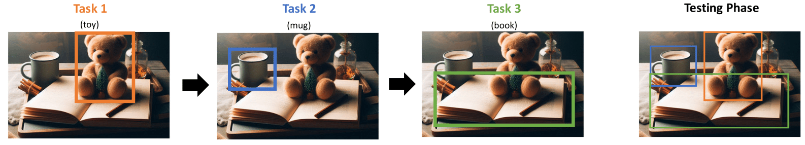

# Replay Consolidation with Label Propagation for Continual Object Detection (RCLPOD)

## Table of contents

* [Introduction](#introduction)
* [Results](#results)
* [Setup](#setup)
* [Usage](#usage)
* [Citation](#citation)

## Introduction
Replay Consolidation with Label Propagation for Continual Object Detection (RCLPOD) is a Continual Learning (CL) approach proposed to solve the Catastrophic Forgetting problem in a Class Incremental scenario for Object Detection.



In particular, this method is applied to the well-known YOLOv8 object detector in several CL scenarios built on VOC and MS COCO datasets. This method exploits Label Propagation and replay memory with OCDM selection mechanism.


## Results
The following table shows a comparison of RCLPOD with other CL methods for YOLOv8n model


The following Figure shows the results for two specific scenarios: VOC15p1 and COCO40p10.


## Setup
In addition to PyTorch, please follow the following steps:
1. Install ```micromind``` with ```pip install git+https://github.com/fpaissan/micromind```.
2. In the ```clod``` directory you find a ```extra_requirements.txt``` file. Please run  ```pip install -r extra_requirements.txt``` to install extra requirements e.g.  ```ultralytics```.


## Usage

1. In the ```clod``` directory you find the source code.
2. Run ```naive_train_yolov8.py cfg/yolov8coco.py``` to run a Fine-Tuning experiment for the COCO datatset.

For each Continual Learning method run instead:
* Run ```naive_train_yolov8.py cfg/yolov8coco.py```for Fine-Tuning
* Run ```replay_train_yolov8.py cfg/yolov8coco.py``` for Replay
* Run ```ocdm_replay_train_yolov8.py cfg/yolov8coco.py```for OCDM
* Run ```lwf_train_yolov8.py cfg/yolov8coco.py``` for LwF
* Run ```pseudo_label_train_yolov8.py cfg/yolov8coco.py``` for Pseudo-label
* Run ```RCLPOD_train_yolov8.py cfg/yolov8coco.py``` for RCLPOD
  
To run an experiment on VOC, use instead the configuration file ```cfg/yolov8voc.py```.

**NOTE**: to change the CL scenario (e.g. 40p40, 40p10, 15p1, etc.) modify the configuration file (either the one for COCO ```cfg/yolov8coco.py``` or the VOC one  ```cfg/yolov8voc.py```) as follows (line 31 in the config file):

```Python
# CLOD
exp = "40p10"  # for COCO40p10
```

```Python
# CLOD
exp = "40p40"  # for COCO40p40
```

## Citation

If you find this project useful in your research, please add a star and cite us 😊 

```BibTeX
@misc{,
  title={Replay Consolidation with Label Propagation for Continual Object Detection},
  author={},
  booktitle={},
  year={2024},
}
```

## Thanks

https://github.com/ultralytics/ultralytics

https://github.com/micromind-toolkit/micromind
